# Lab 1: Debugging a Raspberry Pi Internet of Things Flask Application

|Author|[Dave Glover](https://developer.microsoft.com/en-us/advocates/dave-glover?WT.mc_id=devto-blog-dglover), Microsoft Cloud Developer Advocate |
|----|---|
|Platforms | Linux, macOS, Windows, Raspbian Buster|
|Tools| [Visual Studio Code Insider Edition](https://code.visualstudio.com/insiders)|
|Language| Python|
|Date|As at August 2019|

Follow me on Twitter [@dglover](https://twitter.com/dglover)

## Introduction

In this hands-on lab, you will learn how to create and debug a Python web application on a Raspberry Pi with [Visual Studio Code](https://code.visualstudio.com/) and the [Remote SSH](https://marketplace.visualstudio.com/items?itemName=ms-vscode-remote.remote-ssh) extension.

The web app will read the temperature, humidity, and air pressure telemetry from a BME280 sensor connected to the Raspberry Pi.

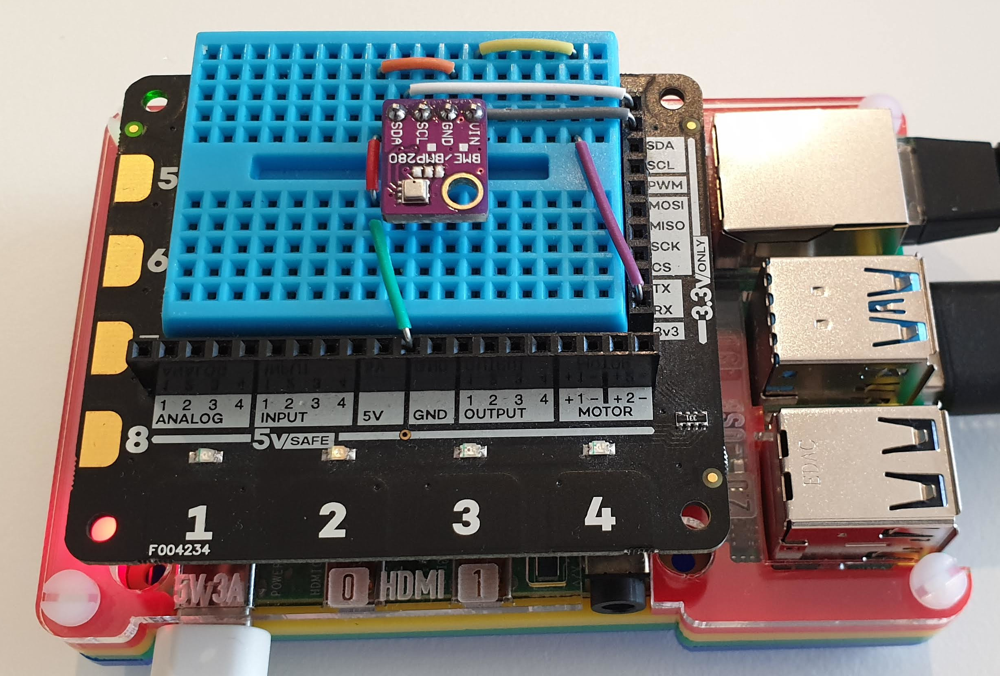

## Remote Development using SSH

The Visual Studio Code Remote - SSH extension allows you to open a remote folder on any remote machine, virtual machine, or container with a running SSH server and take full advantage of Visual Studio Code's feature set. Once connected to a server, you can interact with files and folders anywhere on the remote filesystem.

No source code needs to be on your local machine to gain these benefits since the extension runs commands and other extensions directly on the remote machine.


## Software Installation


This hands-on lab uses Visual Studio Code. Visual Studio Code is a code editor and is one of the most popular **Open Source** projects on GitHub. It is supported on Linux, macOS, and Windows.

Install:

1. [Visual Studio Code Insiders Edition](https://code.visualstudio.com/insiders/)

    As at August 2019, **Visual Studio Code Insiders Edition** is required as it has early support for Raspberry Pi and Remote Development over SSH.

2. [Remote - SSH Visual Studio Code Extension](https://marketplace.visualstudio.com/items?itemName=ms-vscode-remote.remote-ssh)

For information on contributing or submitting issues see the [Visual Studio GitHub Repository](https://github.com/microsoft/vscode). Visual Studio Code documentation is also Open Source, and you can contribute or submit issues from the [Visual Studio Documentation GitHub Repository](https://github.com/microsoft/vscode-docs).

## Raspberry Pi Hardware

If you are attending a workshop then you can use a shared network-connected Raspberry Pi. You can also use your own network-connected Raspberry Pi for this hands-on lab.

### Shared Raspberry Pi

If you are attending a workshop and using a shared Raspberry Pi then you will need the following information from the lab instructor.

1. The **Network IP Address** of the Raspberry Pi
2. Your assigned **login name** and **password**.

### Personal Raspberry Pi

If you using your own network-connected Raspberry Pi, then you need:

1. The Raspberry Pi **Network IP Address**, the **login name**, and **password**.
1. You need to run the following commands in your Raspberry Pi to set two environment variables required for the hands-on lab.

```bash
echo "export LAB_PORT=\$(shuf -i 5000-8000 -n 1)" >> ~/.bashrc
echo "export LAB_HOST=\$(hostname -I)" >>  ~/.bashrc
source .bashrc
```

## SSH Authentication with private/public keys


Setting up public/private keys for SSH authentication is a secure and fast way to authenticate from your developer machine to the Raspberry Pi and is required for this hands-on lab.

The following creates a new SSH key, and copies the public key to the Raspberry Pi.

### From Linux and macOS

1. Create your key. This is typically a one-time operation. **Take the default options**.

```bash
ssh-keygen -t rsa
```

2. Copy the public key to your Raspberry Pi.

```bash
ssh-copy-id <Your Raspberry Pi login name>@<Raspberry IP Address>
```

```bash
For example:

ssh-copy-id dev99@192.168.1.99
```

### From Windows

1. Use the built-in Windows 10 (1809+) OpenSSH client. Install the **OpenSSH Client for Windows** (one time only operation).

    From **PowerShell as Administrator**.

```bash
Add-WindowsCapability -Online -Name OpenSSH.Client
```

2. From PowerShell, create your key. This is typically a one-time operation. **Take the default options**

```bash
ssh-keygen -t rsa
```

3. From PowerShell, copy the public key to your Raspberry Pi

```bash
cat ~/.ssh/id_rsa.pub | ssh `
<Your Raspberry Pi login name>@<Raspberry IP Address> `
"mkdir -p ~/.ssh; cat >> ~/.ssh/authorized_keys"
```

```bash
For example:

cat ~/.ssh/id_rsa.pub | ssh `
dev99@192.168.1.99 `
"mkdir -p ~/.ssh; cat >> ~/.ssh/authorized_keys"
```

## Configure Visual Studio Code Remote SSH Development

We need to tell Visual Studio Code the IP Address and user name we will be using to connect to the Raspberry Pi.

1. Start Visual Studio Code Insiders Edition

2. Click the **Open Remote Windows** button. You will find this button in the bottom left-hand corner of the Visual Studio Code window.

    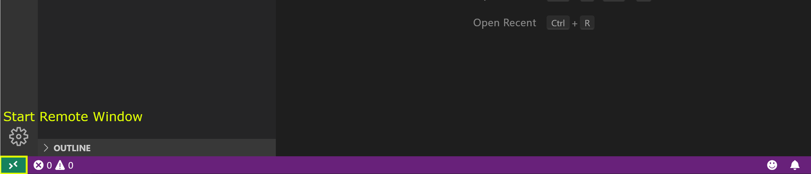

3. Select **Open Configuration File**

    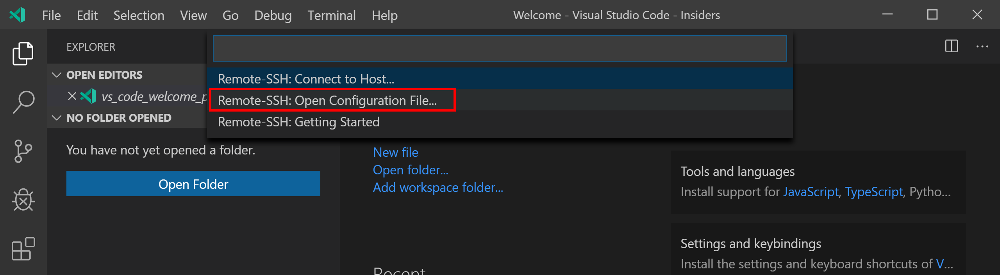

4. Select the user .ssh config file

    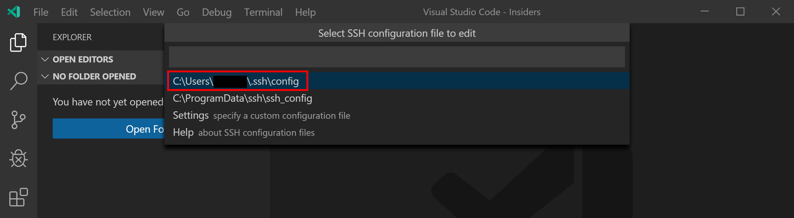

5. Set the SSH connection configuration. You will need the IP Address of the Raspberry Pi and the user name assigned to you for the hands-on lab. Make the changes then save.

    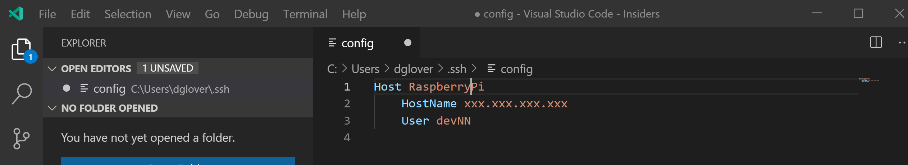

6. Click the Open Remote Windows button (bottom left) then select **Remote SSH: Connect to Host**

    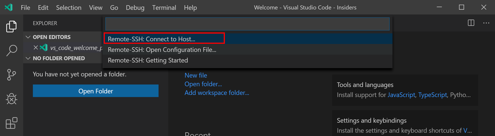

7. Select the host **RaspberryPi** configuration

    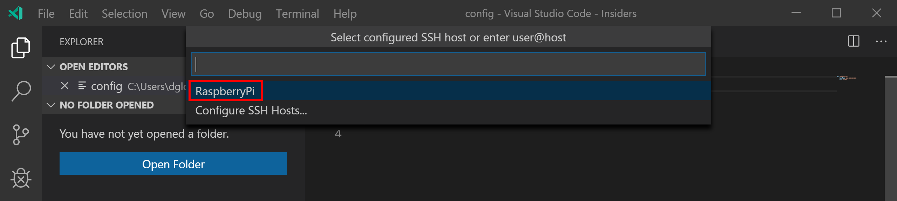

    It will take a moment to connect to the Raspberry Pi.

## Open the Lab 1 SSH Debug Project

From **Visual Studio Code**, select **File** from the main menu, then **Open Folder**. Navigate to and open the **github/Lab1-ssh-debug** folder.

1. From Visual Studio Code: File -> Open Folder
2. Navigate to github/Lab1-ssh-debug directory
3. Open the **app.py** file and review the contents
4. Set a breakpoint at the first line of code in the **show_telemetry** function (**now = datetime.now()**) by doing any one of the following:

    - With the cursor on that line, press F9, or,
    - With the cursor on that line, select the Debug > Toggle Breakpoint menu command, or, Click directly in the margin to the left of the line number (a faded red dot appears when hovering there). The breakpoint appears as a red dot in the left margin:

    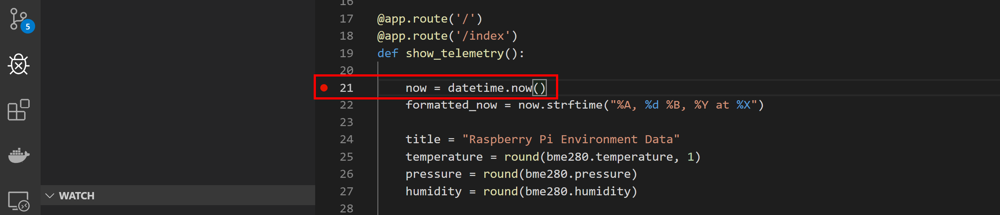

5. Review the debug options.
    1. Switch to Debug view in Visual Studio Code (using the left-side activity bar).

        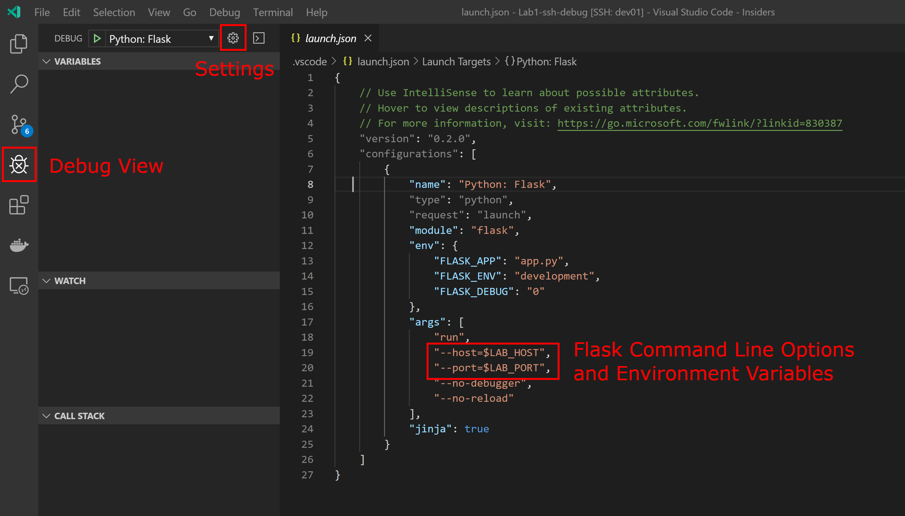

    2. Click the **Settings** button which will open the **launch.json** file.
    3. The **launch.json** file defines how the Flask app will be started, and what [Flask Command Line](https://flask.palletsprojects.com/en/1.0.x/cli/) parameters will be passed on at startup.

        There are two environment variables used in the launch.json file. These are **LAB_HOST** (which is the IP Address of the Raspberry Pi), and **LAB_PORT** (a random TCP/IP Port number between 5000 and 8000). These environment variables are set by the .bashrc script which runs when you connect to the Raspberry Pi with Visual Studio Remote SSH.

6. Press F5 (or click the Run icon) to launch the **Python: Flask** debug configuration. This will start the Web Application on the Raspberry Pi in debug mode.

    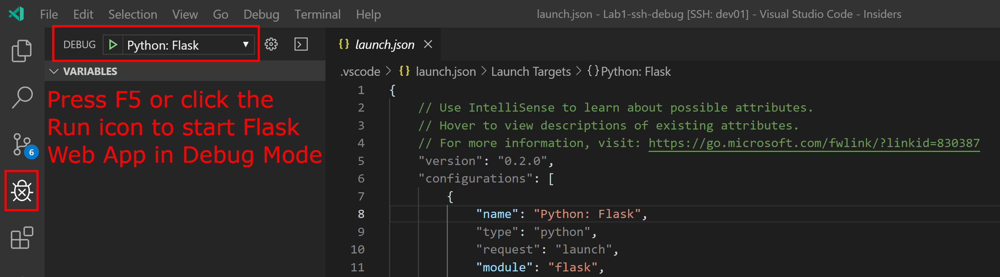

7. Ctrl+click the Flask Web link in the Visual Studio Terminal Window. This will launch your desktop Web Browser.

    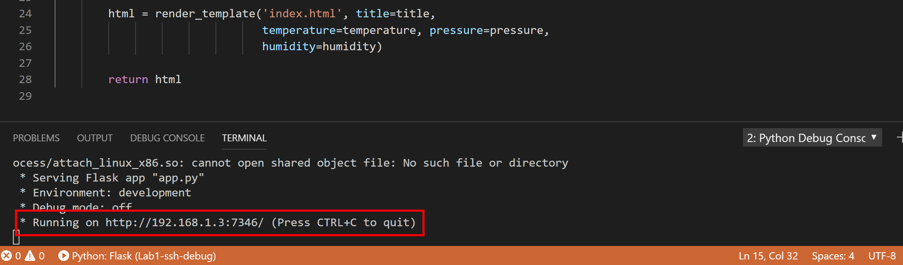

8. Next switch back to Visual Studio Code. The code execution has stopped at the breakpoint you set.

## Debug actions

Once a debug session starts, the **Debug toolbar** will appear at the top of the editor window.


A debugging toolbar (shown above) will appear in Visual Studio Code. It contains the following commands:

1.  Pause (or Continue, F5),
2. Step Over (F10)
3. Step Into (F11),
4. Step Out (Shift+F11),
5. Restart (Ctrl+Shift+F5),
6. and Stop (Shift+F5).

## Using the Debugger

Next, we are going to **Step Into** (F11) the code using the debugging toolbox. Observe the code steps into the **Telemetry** Python class and call the **render_telemetry** method.

### Variable Explorer

1. As you step through the **render_telemetry** method you will notice that Python variables are displayed in the **Variables Window**.

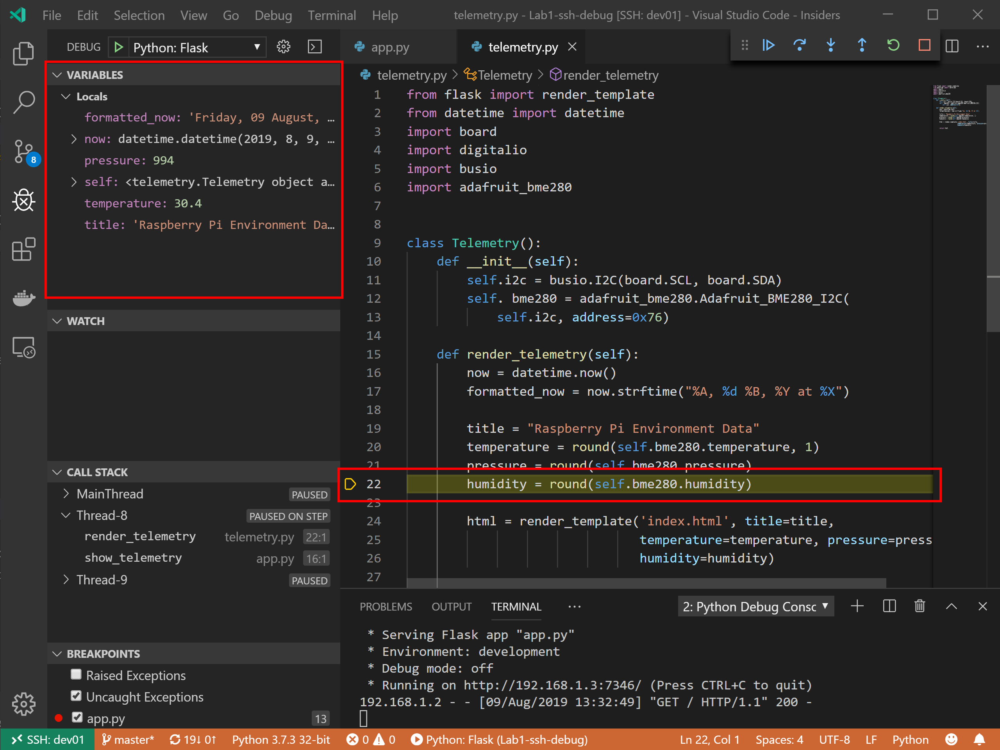

2. Right mouse click a variable, and you will discover you can change, copy, or watch variables. Try to change the value of a variable.

3. Press F5 to resume the Flask App, then switch back to your web browser and you will see that the temperature, humidity, and pressure Sensor data has been returned in the web page.

    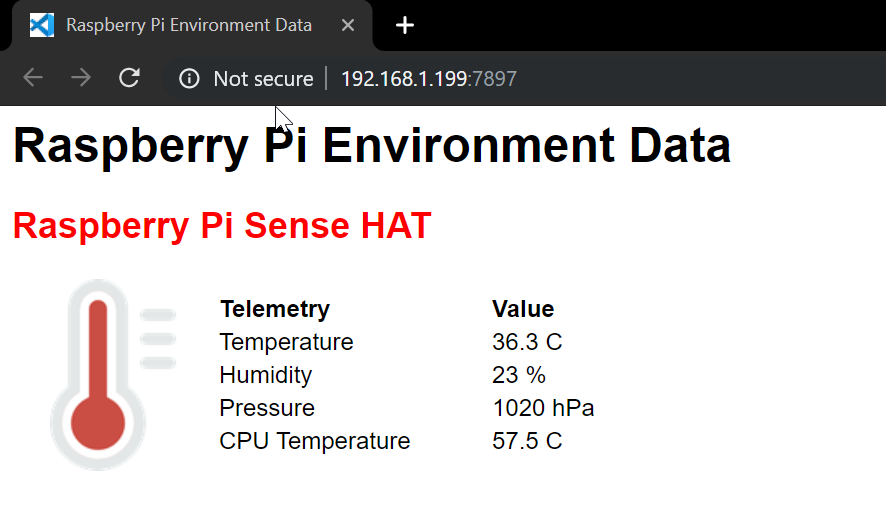

4. Press the **Refresh** button on your web browsers and the breakpoint in your code will be hit again.

## Experiment with Debugger Options

Things to try:

1. Review the [Visual Studio Code Python Tutorial](https://code.visualstudio.com/docs/python/python-tutorial)
1. Review the [Python Flask tutorial](https://vscode-westeu.azurewebsites.net/docs/python/tutorial-flask)
2. Review the [Visual Studio Code Debugging Tutorial](https://code.visualstudio.com/docs/editor/debugging)
3. Try to change the value of a variable from the Visual Studio Code **Variable Window**.
4. Try Setting a **conditional** breakpoint

    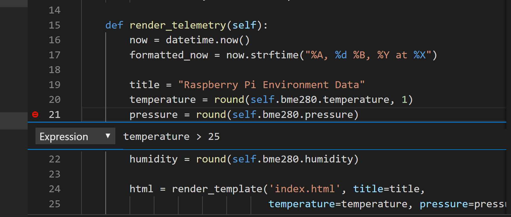
5. Try the Visual Studio Code **Debug Console**. This will give you access to the Pythion REPL, try printing or setting variables, importing libraries etc.

```python
print(temperature)

temperature = 24
```

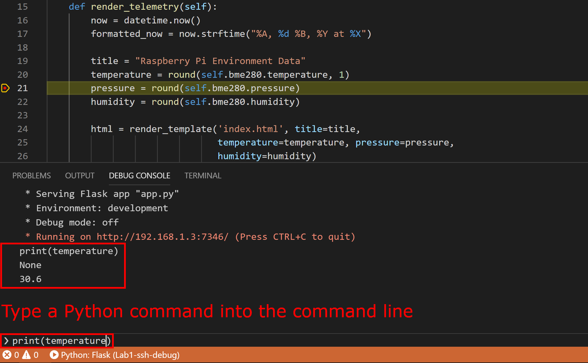

7. Try updating the Flask Template and adding the current date and time to the **index.html**

## Closing the Visual Studio Code Remote SSH

From Visual Studio Code, **Close Remote Connection**.

1. Click the **Remote SSH** button in the bottom left-hand corner and select **Close Remote Connection** from the dropdown list.

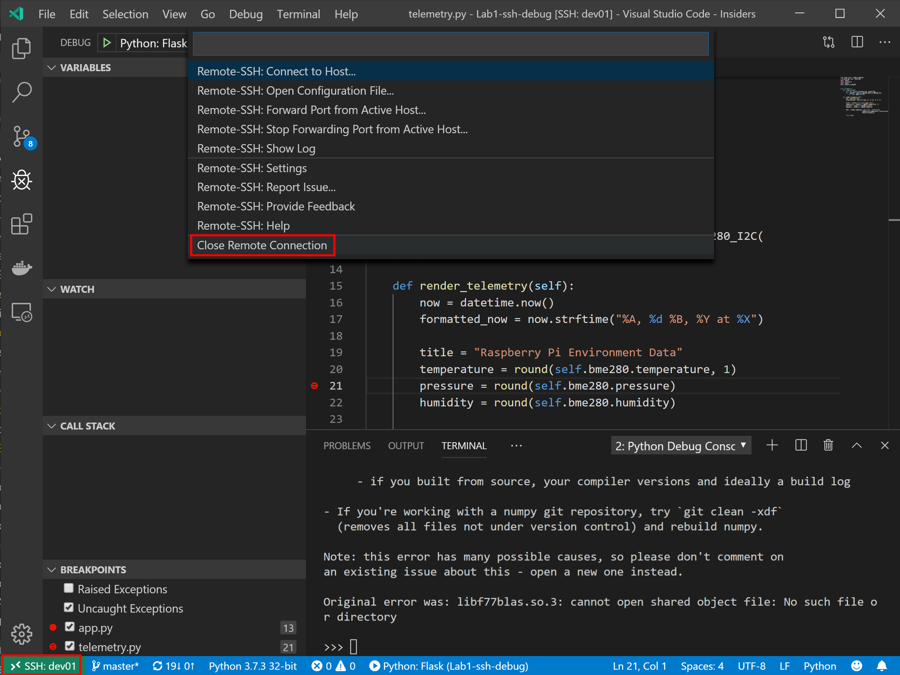

## Finished


## References

- [Visual Studio Code](https://code.visualstudio.com/)
- [Python](https://azure.microsoft.com/en-au/services/iot-central/)
- [Raspberry Pi](https://www.raspberrypi.org/)
- [Flask](https://www.fullstackpython.com/flask.html)
- [Bottle](https://bottlepy.org)
