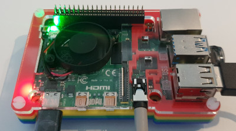

# Debugging Python with Visual Studio Code

## Debugging Tips and Tricks

### Visual Studio Code

Visual Studio Code is a source code editor and is one of the most popular Open Source projects on GitHub. It is supported on Linux, macOS, and Windows.

For information on contributing or submitting issues see the [Visual Studio GitHub Repository](https://github.com/microsoft/vscode). The documentation is also Open Source, you can contribute or submit issues from the [Visual Studio Documentation GitHub Repository](https://github.com/microsoft/vscode-docs).

## Debugging Web and Docker Container Apps on a Raspberry Pi

- [Lab 1: Remote Debugging a Raspberry Pi Flask or Bottle Web](https://github.com/gloveboxes/PyCon-Hands-on-Lab/blob/master/Lab1-ssh-debug/README.md)
- [Lab 2: Raspberry Pi, Python, IoT Central, and Docker Container Debugging](https://github.com/gloveboxes/PyCon-Hands-on-Lab/blob/master/lab2-docker-debug/README.md)

### Jupyter Notebook Debugging

- [Lab 3: Jupyter Notebook Debugging](https://github.com/gloveboxes/PyCon-Hands-on-Lab/blob/master/Lab1-ssh-debug/README.md)

### Getting started with Django and Azure

- [Lab 4: Django and the Cloud](http://aka.ms/pycon2019-workshop)