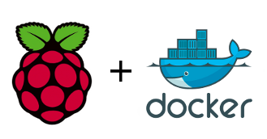

# Raspberry Pi and Visual Studio Code Remote Dev over SSH

## Create up Lab Resources

[Setting I2C permissions for non-root users](https://lexruee.ch/setting-i2c-permissions-for-non-root-users.html)

## Installing Docker on Raspbian Buster



The Azure IoT Edge recommended container runtime is the Moby based engine. For now, Moby doesn't install on Buster, so instead, install Docker-ce.

You need to download the latest versions of **containerd.io**, **docker-ce-cli**, and **docker-ce** from [Docker (armhf) on Buster](https://download.docker.com/linux/debian/dists/buster/pool/stable/armhf).

An easy way to download the files to the Raspberry Pi is from your browser right mouse click the file and copy the link address and then in an SSH session to the Raspberry Pi **wget** each file.

```bash
wget https://download.docker.com/linux/debian/dists/buster/pool/stable/armhf/containerd.io_<LATEST VERSION>_armhf.deb

wget https://download.docker.com/linux/debian/dists/buster/pool/stable/armhf/docker-ce-cli_<LATEST VERSION>~debian-buster_armhf.deb

wget https://download.docker.com/linux/debian/dists/buster/pool/stable/armhf/docker-ce_<LATEST VERSION>~debian-buster_armhf.deb
```

Install the debian packages in the same order you downloaded, add the current user to the docker group, and reboot.

```bash
sudo dpkg -i containerd.io* && \
sudo dpkg -i docker-ce-cli* && \
sudo dpkg -i docker-ce_* && \
sudo usermod -aG docker $USER && \
sudo reboot
```

### Review No Passwords File

```bash
sudo visudo -f /etc/sudoers.d/010_pi-nopasswd
```
