# Lab 2: Raspberry Pi, Python, IoT Central, and Docker Container Debugging

In this hands-on lab, you will learn how to create an Internet of Things (IoT) Python application with [Visual Studio Code](https://code.visualstudio.com/), run it in a Docker Container on a Raspberry Pi, and attach and debug the code running in the container.

## References

- [Visual Studio Code](https://code.visualstudio.com/)
- [Azure IoT Central](https://azure.microsoft.com/en-au/services/iot-central)
- [Python](https://azure.microsoft.com/en-au/services/iot-central/)
- [Raspberry Pi](https://www.raspberrypi.org/)
- [Installing Docker on Raspberry Pi Buster](https://dev.to/azure/azure-iot-edge-on-raspberry-pi-buster-plus-tips-for-raspberry-pi-4-22nn)
- [Understanding Docker in 12 Minutes](https://www.youtube.com/watch?v=YFl2mCHdv24&t=358s)

## Lab Information

You need the following information for the Hands-on Lab.

1. The IP Address of the Raspberry Pi
1. Your login name. The default password is **raspberry**.

## Hand-on Lab Overview

This is the flow of the Hands-on Lab:

1. Install the required software
2. Configuring SSH security
3. Connecting Visual Studio Code to the Raspberry Pi over SSH
4. Create an Azure IoT Central application
5. Configure, Build, and Run the Docker Container on the Raspberry Pi.
6. Attach and debug the application running in the Docker Container on the Raspberry Pi.

## Software Requirements


As at August 2019, **Visual Studio Code Insiders Edition** is required as it has early support for Remote Development over SSH.

Visual Studio Code is a source code editor and is one of the most popular Open Source projects on GitHub. It is supported on Linux, macOS, and Windows.

For information on contributing or submitting issues see the [Visual Studio GitHub Repository](https://github.com/microsoft/vscode). The documentation is also Open Source, you can contribute or submit issues from the [Visual Studio Documentation GitHub Repository](https://github.com/microsoft/vscode-docs).

1. Install [Visual Studio Code Insiders Edition](https://code.visualstudio.com/insiders/)
1. Install the [Remote - SSH Visual Studio Code Extension](https://marketplace.visualstudio.com/items?itemName=ms-vscode-remote.remote-ssh)
1. Install the [Docker VS Code Extension](https://marketplace.visualstudio.com/items?itemName=ms-azuretools.vscode-docker)

## SSH Authentication with private/public keys


Setting up public/private keys for SSH login and authentication is a secure and fast way to authenticate with the Raspberry Pi and required for this hands-on lab.

The following creates a new SSH key, copies the public key to the Raspberry Pi. 

**Take the default options**.

### From Windows

1. Use the built-in Windows 10 (1809+) OpenSSH client. First, install the **OpenSSH Client for Windows** (one time only operation).

    From **PowerShell as Administrator**.

```bash
Add-WindowsCapability -Online -Name OpenSSH.Client
```

2. From PowerShell, create a key pair.

```bash
ssh-keygen -t rsa
```

3. From PowerShell, copy the public key to your Raspberry Pi

```bash
cat ~/.ssh/id_rsa.pub | ssh <Your user name>@<Raspberry IP Address> "mkdir -p ~/.ssh; cat >> ~/.ssh/authorized_keys"
```

### From Linux, macOS, and the Windows Subsystem for Linux

1. Create your key. Typically a one-time operation.

```bash
ssh-keygen -t rsa
```

2. Copy the public key to your Raspberry Pi. From Linux and macOS.

```bash
ssh-copy-id <Your user name>@<Raspberry IP Address>
```

## Configure Visual Studio Code Remote SSH Development

We need to tell Visual Studio Code the IP Address and user name we will be using to connect to the Raspberry Pi.

1. Start Visual Studio Code Insiders Edition

2. Click the **Open Remote Windows** button. You will find this button on the bottom lefthand corner of the Visual Studio Code window.

    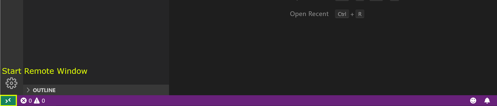

3. Select **Open Configuration File**

    

4. Select the user .ssh config file

    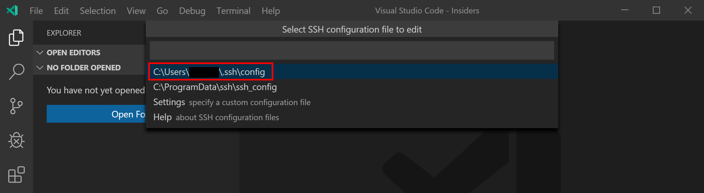

5. Set the SSH connection configuration. You will need the IP Address of the Raspberry Pi and the user name assigned to you for the hands-on lab. Make the changes then save.

    

6. Click the Open Remote Windows button (bottom left) then select **Remote SSH: Connect to Host**

    

7. Select the host **RaspberryPi** configuration

    

    It will take a moment to connect to the Raspberry Pi.

## Open the Lab2 Docker Debug Project

From **Visual Studio Code**, select **File** from the main menu, then **Open Folder**. Navigate to and open the **github/lab2-docker-debug** folder.

1. From VS Code: File -> Open Folder, navigate to github/lab2-docker-debug
2. Expand the App folder, and open the app.py file.

## Creating an Azure IoT Central application

Next we are going to create an Azure IoT Central application, then create a device, and finally create an Azure IoT Hub device connection string required for the application that will run in the Docker Container.

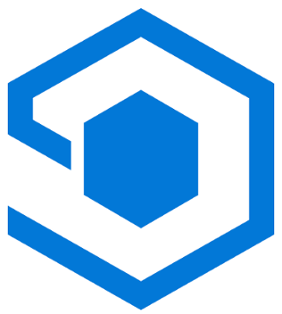

As a _builder_, you use the Azure IoT Central UI to define your Microsoft Azure IoT Central application. This quickstart shows you how to create an Azure IoT Central application that contains a sample _device template_ and simulated _devices_.

Navigate to the Azure IoT Central [Application Manager](https://aka.ms/iotcentral) page. You will need to sign in with a Microsoft personal or work or school account.

## Step 1: Create a New IoT Central Application

Watch this 5-minute [screencast](https://youtu.be/D26rJmHyZcA) on how to create the Azure IoT Central Application to chart telemetry and send commands to your Particle Photon.

[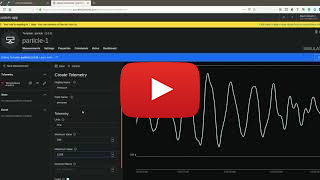](https://www.youtube.com/watch?v=D26rJmHyZcA&t=5s)

To summarize the screencast:

1. Create a new Azure IoT Central application, select **New Application**. This takes you to the **Create Application** page.

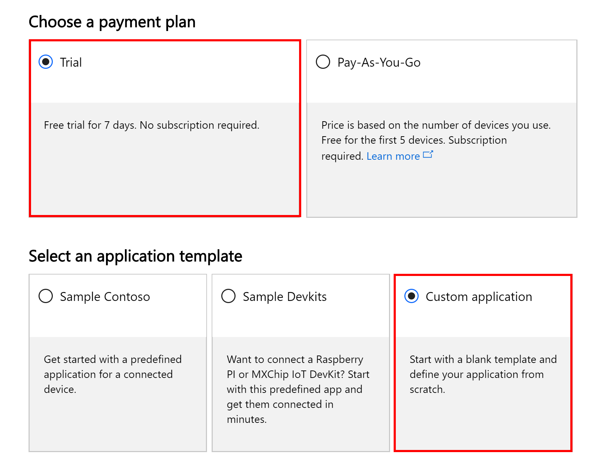


1. Click **Create Device Templates**, then select **Custom** template, name your template, for example, "Raspberry". Then click Create

    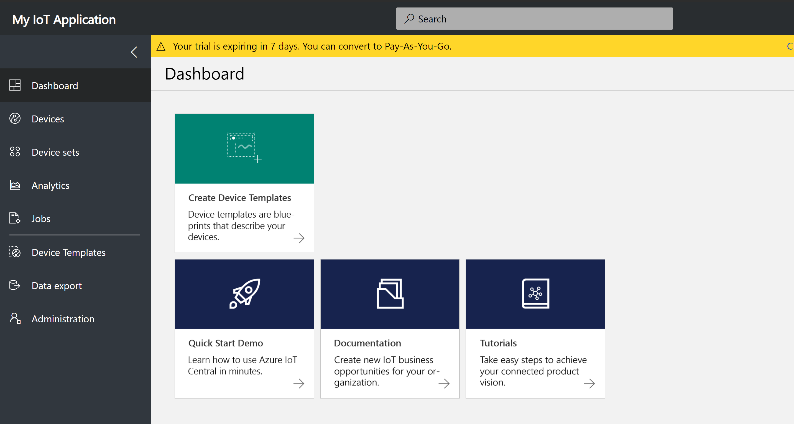

5. Edit the Template, add **Measurements** for **Temperature**, **Humidity**, and **Pressure** telemetry. You need to click **Save** after each measurement is defined.

    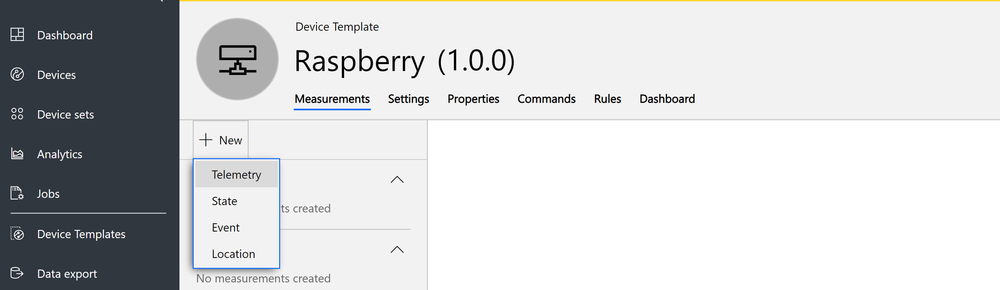

    |Display Name| Field name     | Units  | Minimum | Maximum | Decimals |
    |------------| -------------- | ------ | ------- | ------- | -------- |
    |Humidity    | Humidity       | %      | 0       | 100     | 0        |
    |Temperature | Temperature    | degC   | -10     | 60      | 0        |
    |Pressure    | Pressure       | hPa    | 800     | 1260    | 0        |

    


6. Click **Device** on the sidebar menu, select the **Raspberry** template you created. Then add a **Real Device**

    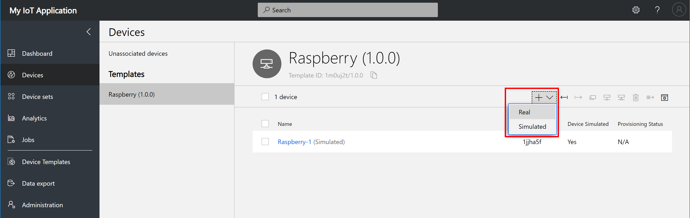

    Give your device a sensible **Device Id**, then click **Create**.

    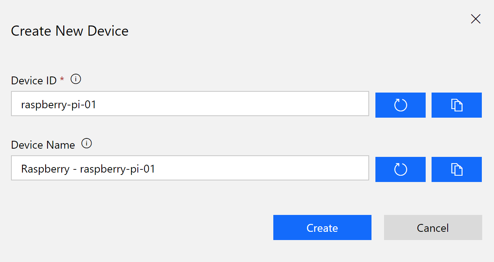

7. When you have created your real device click the **Connect** button in the top right-hand corner of the screen to display the device credentials.

    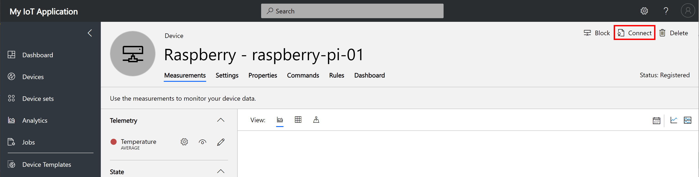

    You will need these credentials for the next step.

    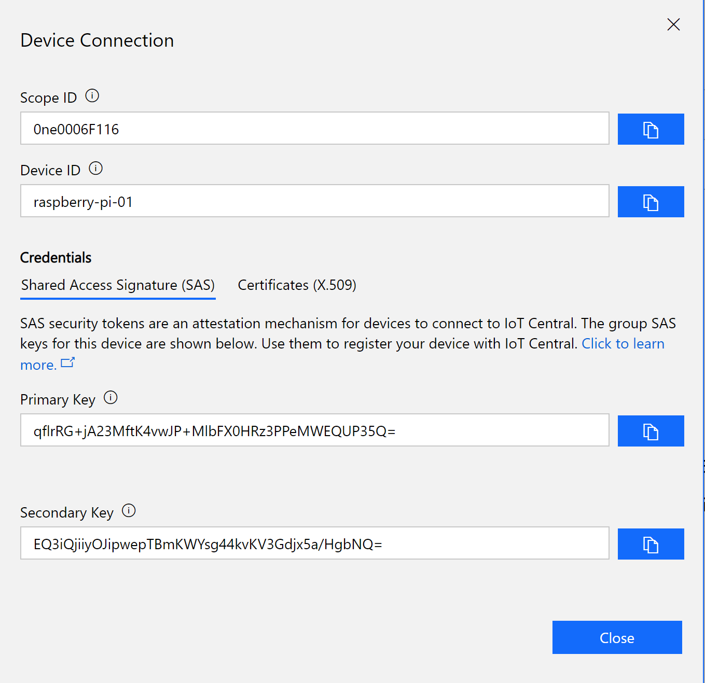


## Next steps

## Generate an Azure IoT Hub Connection String

Hold the control key down and click the following link [Connection String Generator](https://dpsgen.z8.web.core.windows.net/) to open in a new tab.

Copy and paste the **Scope Id**, **Device Id**, and the **Primary Key** from the Azure IoT Central Device Connection panel to the Connection String Generator page and click "Get Connection String".

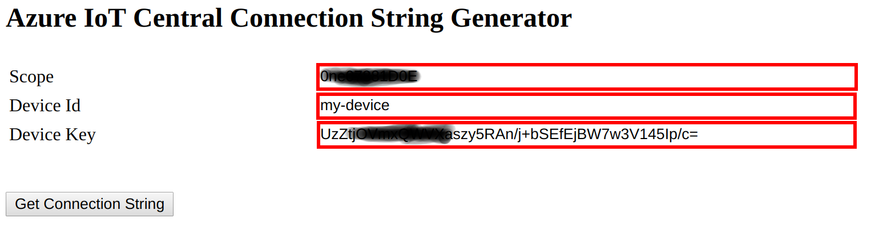

Copy the generated connection string to the clipboard as you will need it for the next step.

## Open the Visual Studio Code Docker Debugging Lab

Switch back to the project you opened with Visual Studio Code. Ensure the **app.py** file is open.

1. Paste the connection string you copied in the previous step to the **connectionString** variable.

    The connection string line will look similar to this.

    ```python
    connectionString = 'HostName=saas-iothub-812327b-f33a-7878-a44a-7ca898989b6.azure-devices.net;DeviceId=dev01;SharedAccessKey=OAlZmsssIGrgjzPaxxxxxxxyI5Yi1Am9w/db4='
    ```

    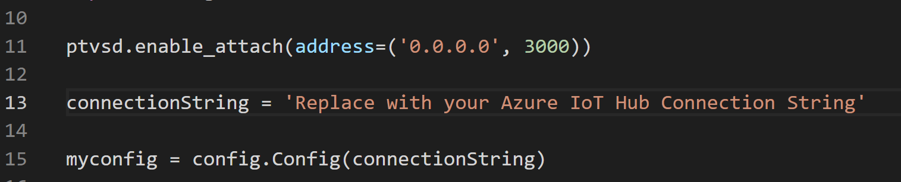

1. Right mouse click the Dockerfile and select **Build Image**
1. Give your docker build image a **unique name** - eg the first part of your email address, your nickname, something memorable. The name needs to be unique otherwise it will clash with other users.

    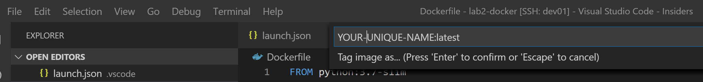

4. When your Docker image has built then start the docker container from the VS Code terminal window.

    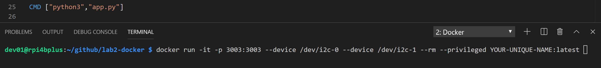

5. Click [Random Number Generator](https://www.random.org/integers/?num=100&min=3000&max=5000&col=5&base=10&format=html&rnd=new) and pick a number (and make a note of it). This will become your IP Port number that you will use to attach the Visual Studio Code debugger.

```bash
docker run -it -p YOUR_RANDOM_PORT_NUMBER:3003 --device /dev/i2c-0 --device /dev/i2c-1 --rm --privileged YOUR_IMAGE_NAME:latest
```

## Configure the Visual Studio Debugger

1. Expand the .vscode folder, open the launch.json file
2. Change the current port (3005) to the randomly generated port number you used when you started the Docker container

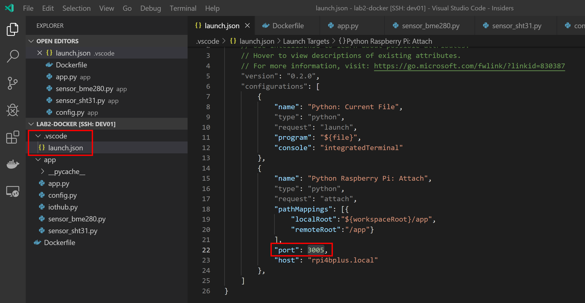You can view the telemetry measurements and reported property values, and configure settings in Azure IoT Central:

## Attach the Debugger to the Docker Container

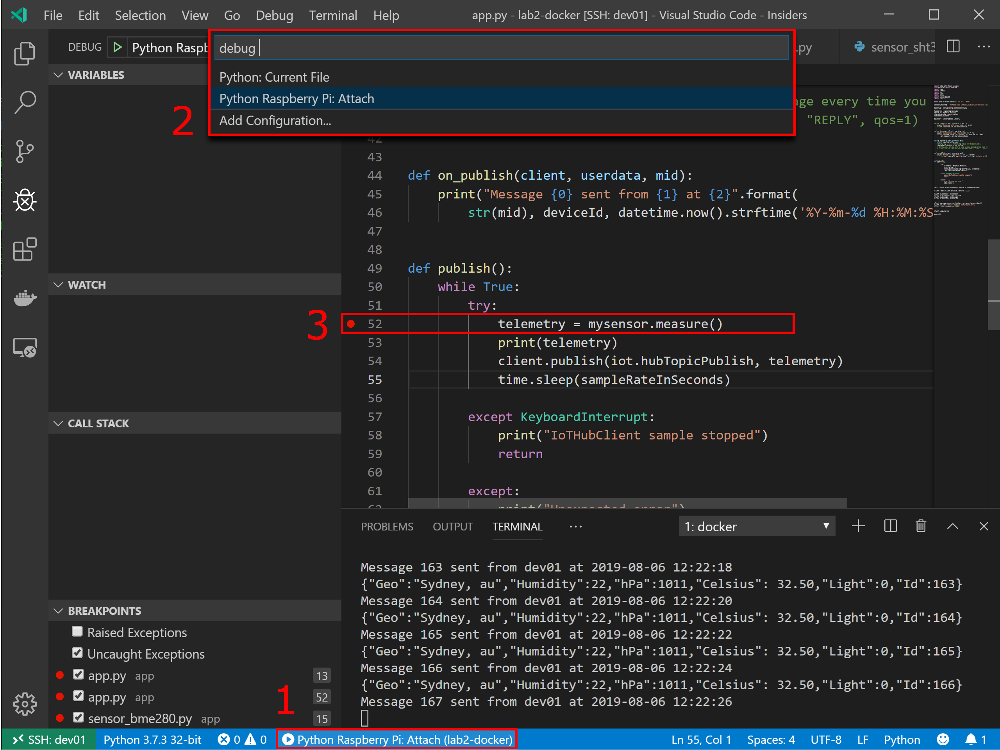

## Debugger Controls

Debugger Controls allow for Starting, Pausing, Stepping in to, Stepping out off, restarting code, and finally disconnecting the debugger.

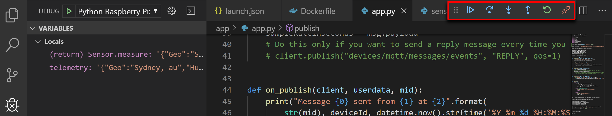

## Exploring Device Telemetry in Azure IoT Central

1. Use **Device Explorer** to navigate to the **Measurements** page for the real Raspberry Pi device you added:

    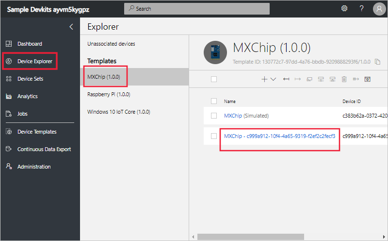

1. On the **Measurements** page, you can see the telemetry streaming from the Raspberry Pi device:

    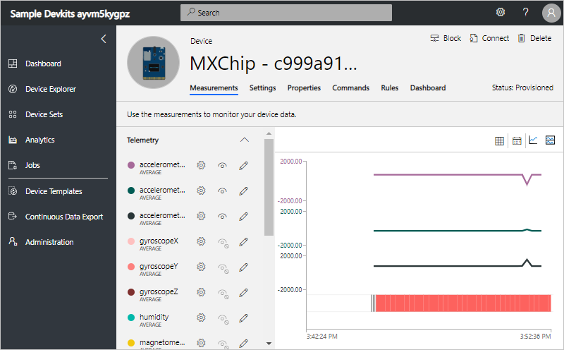

## Finished

 

## Appendix

### Azure IoT Central

# Take a tour of the Azure IoT Central UI

This article introduces you to the Microsoft Azure IoT Central UI. You can use the UI to create, manage, and use an Azure IoT Central solution and its connected devices.

As a _builder_, you use the Azure IoT Central UI to define your Azure IoT Central solution. You can use the UI to:

- Define the types of device that connect to your solution.
- Configure the rules and actions for your devices.
- Customize the UI for an _operator_ who uses your solution.

As an _operator_, you use the Azure IoT Central UI to manage your Azure IoT Central solution. You can use the UI to:

- Monitor your devices.
- Configure your devices.
- Troubleshoot and remediate issues with your devices.
- Provision new devices.


## Use the left navigation menu

Use the left navigation menu to access the different areas of the application. You can expand or collapse the navigation bar by selecting **<** or **>**:

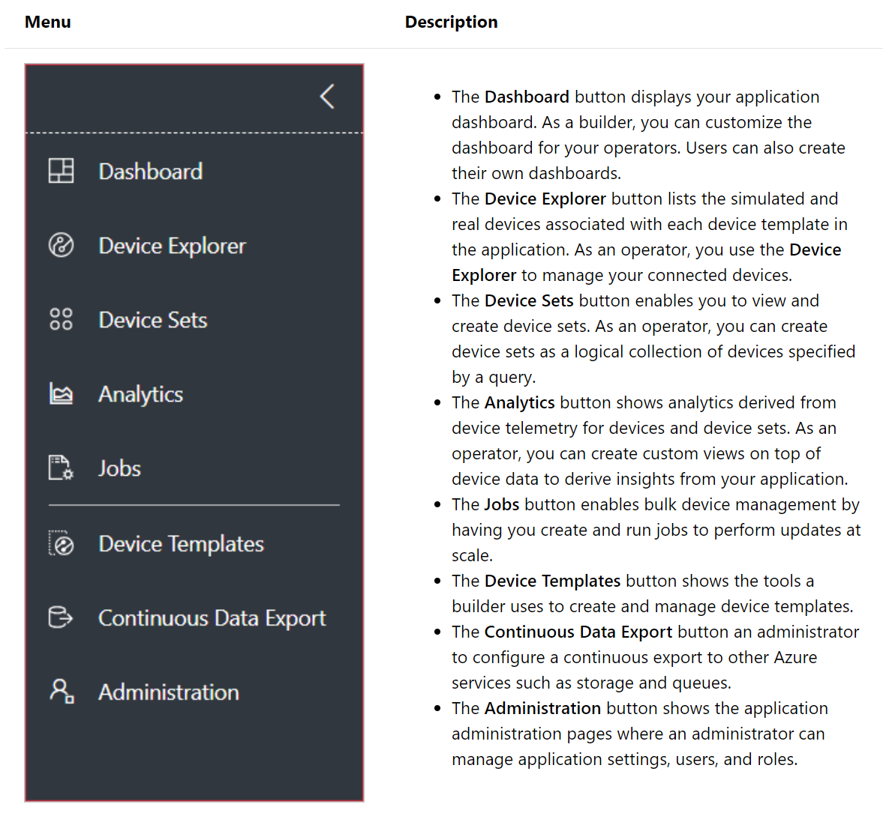

## Search, help, and support

The top menu appears on every page:

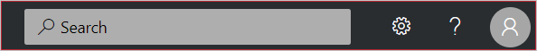

- To search for device templates and devices, enter a **Search** value.
- To change the UI language or theme, choose the **Settings** icon.
- To sign out of the application, choose the **Account** icon.
- To get help and support, choose the **Help** drop-down for a list of resources. In a trial application, the support resources include access to [live chat](https://docs.microsoft.com/en-us/azure/iot-central/howto-show-hide-chat?WT.mc_id=github-blog-dglover).

You can choose between a light theme or a dark theme for the UI:


## Dashboard

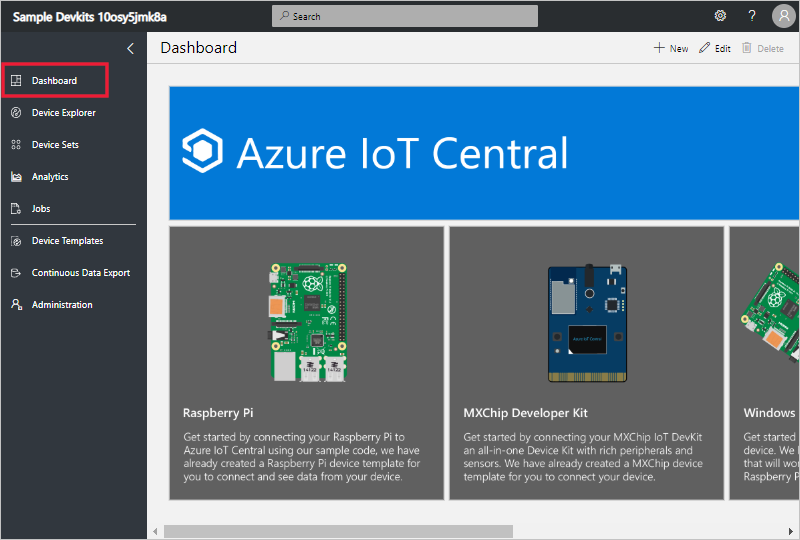

The dashboard is the first page you see when you sign in to your Azure IoT Central application. As a builder, you can customize the application dashboard for other users by adding tiles. To learn more, see the [Customize the Azure IoT Central operator's view](https://docs.microsoft.com/en-us/azure/iot-central/tutorial-customize-operator?WT.mc_id=github-blog-dglover) tutorial. Users can also [create their own personal dashboards](https://docs.microsoft.com/en-us/azure/iot-central/howto-personalize-dashboard?WT.mc_id=github-blog-dglover).

## Device explorer

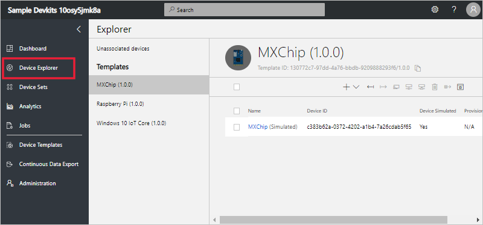

The explorer page shows the _devices_ in your Azure IoT Central application grouped by _device template_.

* A device template defines a type of device that can connect to your application. To learn more, see the [Define a new device type in your Azure IoT Central application](https://docs.microsoft.com/en-us/azure/iot-central/tutorial-define-device-type?WT.mc_id=github-blog-dglover).
* A device represents either a real or simulated device in your application. To learn more, see the [Add a new device to your Azure IoT Central application](https://docs.microsoft.com/en-us/azure/iot-central/tutorial-add-device?WT.mc_id=github-blog-dglover).

## Device sets

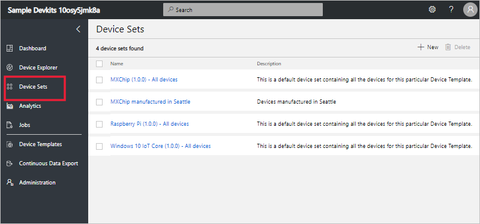

The _device sets_ page shows device sets created by the builder. A device set is a collection of related devices. A builder defines a query to identify the devices that are included in a device set. You use device sets when you customize the analytics in your application. To learn more, see the [Use device sets in your Azure IoT Central application](https://docs.microsoft.com/en-us/azure/iot-central/howto-use-device-sets?WT.mc_id=github-blog-dglover) article.

## Device Templates


The device templates page is where a builder creates and manages the device templates in the application. To learn more, see the [Define a new device type in your Azure IoT Central application](https://docs.microsoft.com/en-us/azure/iot-central/tutorial-define-device-type?WT.mc_id=github-blog-dglover) tutorial.


#### Analytics


The analytics page shows charts that help you understand how the devices connected to your application are behaving. An operator uses this page to monitor and investigate issues with connected devices. The builder can define the charts shown on this page. To learn more, see the [Create custom analytics for your Azure IoT Central application](https://docs.microsoft.com/en-us/azure/iot-central/howto-use-device-sets?WT.mc_id=github-blog-dglover) article.

#### Jobs

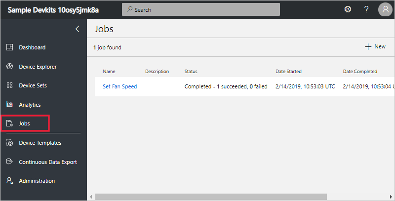

The jobs page allows you to perform bulk device management operations onto your devices. The builder uses this page to update device properties, settings, and commands. To learn more, see the [Run a job](https://docs.microsoft.com/en-us/azure/iot-central/howto-run-a-job?WT.mc_id=github-blog-dglover) article.

#### Continuous Data Export


The continuous data export page is where an administrator defines how to export data, such as telemetry, from the application. Other services can store the exported data or use it for analysis. To learn more, see the [Export your data in Azure IoT Central](https://docs.microsoft.com/en-us/azure/iot-central/howto-export-data?WT.mc_id=github-blog-dglover) article.

#### Administration

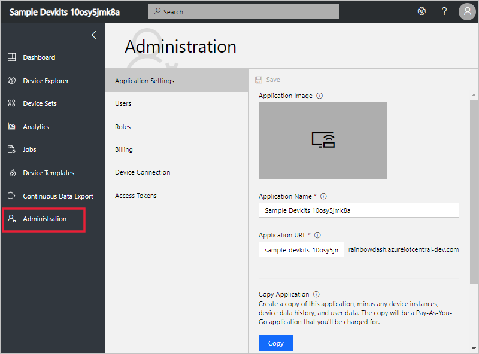

The administration page contains links to the tools an administrator uses such as defining users and roles in the application. To learn more, see the [Administer your Azure IoT Central application](https://docs.microsoft.com/en-us/azure/iot-central/howto-administer?WT.mc_id=github-blog-dglover) article.
