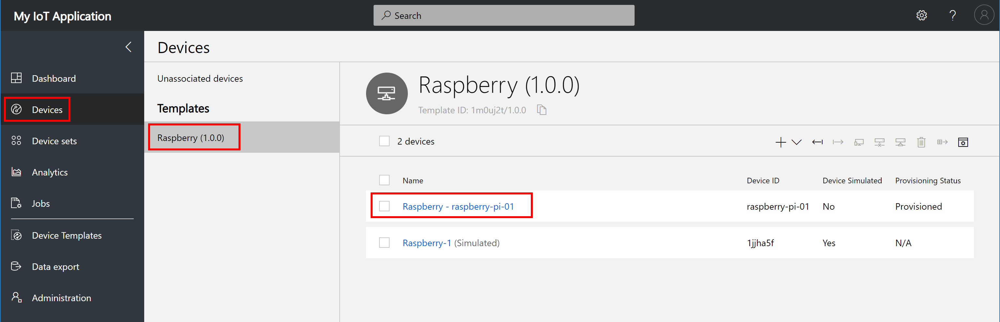
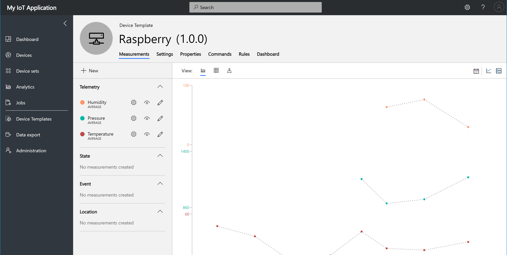

# Lab 2: Raspberry Pi, Python, IoT Central, and Docker Container Debugging

In this hands-on lab, you will learn how to create an Internet of Things (IoT) Python application with [Visual Studio Code](https://code.visualstudio.com/), run it in a Docker Container on a Raspberry Pi, read the temperature, humidity, and air pressure telemetry from a BME280 sensor, then attach, and debug the Python code running in the container.


## References

- [Visual Studio Code](https://code.visualstudio.com/)
- [Azure IoT Central](https://azure.microsoft.com/en-au/services/iot-central)
- [Installing Docker on Raspberry Pi Buster](https://dev.to/azure/azure-iot-edge-on-raspberry-pi-buster-plus-tips-for-raspberry-pi-4-22nn)
- [Understanding Docker in 12 Minutes](https://www.youtube.com/watch?v=YFl2mCHdv24&t=358s)

## Remote Development using SSH

The Visual Studio Code Remote - SSH extension allows you to open a remote folder on any remote machine, virtual machine, or container with a running SSH server and take full advantage of Visual Studio Code's feature set. Once connected to a server, you can interact with files and folders anywhere on the remote filesystem.

No source code needs to be on your local machine to gain these benefits since the extension runs commands and other extensions directly on the remote machine.


## Software Installation


This hands-on lab uses Visual Studio Code. Visual Studio Code is a code editor and is one of the most popular **Open Source** projects on GitHub. It is supported on Linux, macOS, and Windows.

Install:

1. [Visual Studio Code Insiders Edition](https://code.visualstudio.com/insiders/)

    As at August 2019, **Visual Studio Code Insiders Edition** is required as it has early support for Raspberry Pi and Remote Development over SSH.

2. [Remote - SSH Visual Studio Code Extension](https://marketplace.visualstudio.com/items?itemName=ms-vscode-remote.remote-ssh)
3. [Docker Extension](https://marketplace.visualstudio.com/items?itemName=ms-azuretools.vscode-docker)

For information on contributing or submitting issues see the [Visual Studio GitHub Repository](https://github.com/microsoft/vscode). Visual Studio Code documentation is also Open Source, and you can contribute or submit issues from the [Visual Studio Documentation GitHub Repository](https://github.com/microsoft/vscode-docs).

## Raspberry Pi Hardware

If you are attending a workshop then you can use a shared network-connected Raspberry Pi. You can also use your own network-connected Raspberry Pi for this hands-on lab.

### Shared Raspberry Pi

If you are attending a workshop and using a shared Raspberry Pi then you will need the following information from the lab instructor.

1. The **Network IP Address** of the Raspberry Pi
2. Your assigned **login name** and **password**.

### Personal Raspberry Pi

If you using your own network-connected Raspberry Pi, then you need:

1. The Raspberry Pi **Network IP Address**, the **login name**, and **password**.
1. You need to run the following commands in your Raspberry Pi to set two environment variables required for the hands-on lab.

```bash
echo "export LAB_PORT=\$(shuf -i 5000-8000 -n 1)" >> ~/.bashrc
echo "export LAB_HOST=\$(hostname -I)" >>  ~/.bashrc
source .bashrc
```

## SSH Authentication with private/public keys


Setting up public/private keys for SSH authentication is a secure and fast way to authenticate from your developer machine to the Raspberry Pi and is required for this hands-on lab.

The following creates a new SSH key, and copies the public key to the Raspberry Pi.

### From Linux and macOS

1. Create your key. This is typically a one-time operation. **Take the default options**.

```bash
ssh-keygen -t rsa
```

2. Copy the public key to your Raspberry Pi.

```bash
ssh-copy-id <Your Raspberry Pi login name>@<Raspberry IP Address>
```

```bash
For example:

ssh-copy-id dev99@192.168.1.99
```

### From Windows

1. Use the built-in Windows 10 (1809+) OpenSSH client. Install the **OpenSSH Client for Windows** (one time only operation).

    From **PowerShell as Administrator**.

```bash
Add-WindowsCapability -Online -Name OpenSSH.Client
```

2. From PowerShell, create your key. This is typically a one-time operation. **Take the default options**

```bash
ssh-keygen -t rsa
```

3. From PowerShell, copy the public key to your Raspberry Pi

```bash
cat ~/.ssh/id_rsa.pub | ssh `
<Your Raspberry Pi login name>@<Raspberry IP Address> `
"mkdir -p ~/.ssh; cat >> ~/.ssh/authorized_keys"
```

```bash
For example:

cat ~/.ssh/id_rsa.pub | ssh `
dev99@192.168.1.99 `
"mkdir -p ~/.ssh; cat >> ~/.ssh/authorized_keys"
```

## Configure Visual Studio Code Remote SSH Development

We need to tell Visual Studio Code the IP Address and user name we will be using to connect to the Raspberry Pi.

1. Start Visual Studio Code Insiders Edition

2. Click the **Open Remote Windows** button. You will find this button in the bottom left-hand corner of the Visual Studio Code window.

    

3. Select **Open Configuration File**

    

4. Select the user .ssh config file

    

5. Set the SSH connection configuration. You will need the IP Address of the Raspberry Pi and the user name assigned to you for the hands-on lab. Make the changes then save.

    

6. Click the Open Remote Windows button (bottom left) then select **Remote SSH: Connect to Host**

    

7. Select the host **RaspberryPi** configuration

    

    It will take a moment to connect to the Raspberry Pi.

## Open the Lab2 Docker Debug Project

From **Visual Studio Code**, select **File** from the main menu, then **Open Folder**. Navigate to and open the **github/lab2-docker-debug** folder.

1. From VS Code: File -> Open Folder, navigate to github/lab2-docker-debug
2. Expand the App folder, and open the app.py file.

## Creating an Azure IoT Central application

We are going to create an Azure IoT Central application, then create a device, and finally create an Azure IoT Hub device connection string required for the application that will run in the Docker Container.


As a _builder_, you use the Azure IoT Central UI to define your Microsoft Azure IoT Central application. This quickstart shows you how to create an Azure IoT Central application that contains a sample _device template_ and simulated _devices_.

## Create a New IoT Central Application

1. Open the the [Azure IoT Central](https://aka.ms/iotcentral) in a new browser tab (left click the link).

2. Next, you'll need to sign with your Microsoft personal or work or school account. If you don't have one, you can create one for free using the Create one! link.

    

3. Create a new Azure IoT Central application, select **New Application**. This takes you to the **Create Application** page.

4. Select **Trail**, **Custom application**, name your IoT Central application, and complete the sign up information.


4. Click **Create Device Templates**, then select **Custom** template, name your template, for example, **Raspberry**. Then click Create

    

5. Edit the Template, add **Measurements** for **Temperature**, **Humidity**, and **Pressure** telemetry.

    Measurements are the data that comes from your device. You can add multiple measurements to your device template to match the capabilities of your device.

    - **Telemetry** measurements are the numerical data points that your device collects over time. They're represented as a continuous stream. An example is temperature.
    - **Event** measurements are point-in-time data that represents something of significance on the device. A severity level represents the importance of an event. An example is a fan motor error.
    - **State** measurements represent the state of the device or its components over a period of time. For example, a fan mode can be defined as having Operating and Stopped as the two possible states.
    - **Location** measurements are the longitude and latitude coordinates of the device over a period of time in. For example, a fan can be moved from one location to another.

    

    Use the information in the following table to set up the three telemetry measurements. The field name is case-sensitive.

    You **must** click **Save** after each measurement is defined.

    |Display Name| Field name     | Units  | Minimum | Maximum | Decimals |
    |------------| -------------- | ------ | ------- | ------- | -------- |
    |Humidity    | Humidity       | %      | 0       | 100     | 0        |
    |Temperature | Temperature    | degC   | -10     | 60      | 0        |
    |Pressure    | Pressure       | hPa    | 800     | 1260    | 0        |

    The following is an example of setting up the Temperature telemetry measurement.

    

6. Click **Device** on the sidebar menu, select the **Raspberry** template you created.

    IoT central supports real devices, such as the Raspberry Pi used for this lab, as well as simulated devices which generate random data  useful for system testing.

7. Select **Real**.

    

    Name your **Device Id** so you can easily identified the device in the IoT Central portal, then click **Create**.

    

7. When you have created your real device click the **Connect** button in the top right-hand corner of the screen to display the device credentials.

    

    **Leave this page open as you will need this connection information for the next step in the hands-on lab.**

    

## Generate an Azure IoT Hub Connection String

1. Hold the control key down and click the following link [Connection String Generator](https://dpsgen.z8.web.core.windows.net/) to open in a new tab.

    Copy and paste the **Scope Id**, **Device Id**, and the **Primary Key** from the Azure IoT Central Device Connection panel to the Connection String Generator page and click "Get Connection String".
    
    

2. Copy the generated connection string to the clipboard as you will need it for the next step.

## Open the Visual Studio Code Docker Debugging Lab

Switch back to the project you opened with Visual Studio Code. Ensure the **app.py** file is open.

1. Paste the connection string you copied in the previous step to the **connectionString** variable.

```python
    connectionString = '<Your IoT Hub Connection String>'
```

2. Ensure **Explorer** selected in the activity bar, right mouse click file named **Dockerfile** and select **Build Image**.


1. Give your docker build image a **unique name** - eg the first part of your email address, your nickname, something memorable, followed by **:latest**. The name needs to be unique otherwise it will clash with other users.

    For example **glovebox:latest**


2. Copy and Paste the following commands to your preferred desktop text editor.

```bash
IMAGE_NAME=Your-Unique-Image-Name:latest
echo -e "\e[7mYour Lab Port is $LAB_PORT\e[0m"
docker run -it -p $LAB_PORT:3000 \
--device /dev/i2c-0 --device /dev/i2c-1 \
--rm --privileged $IMAGE_NAME:latest
```

3. Update **IMAGE_NAME** with the unique name you choose when you created the Docker Image.

    For example:

```bash
IMAGE_NAME=glovebox:latest
echo -e "\e[7mYour Lab Port is $LAB_PORT\e[0m"
docker run -it -p $LAB_PORT:3000 \
--device /dev/i2c-0 --device /dev/i2c-1 \
--rm --privileged $IMAGE_NAME
```

- The **Docker run** will start your container in interactive mode (**--it**), will map the **$LAB_PORT** to port 3000 in the container (**-p**), the BME280 sensor is connected to the host [I2C](https://en.wikipedia.org/wiki/I%C2%B2C) bus, (**--device**) maps the host I2C bus into the container, (**--rm**) removes the container when you stop it, (**--privileged**) grants elevated permissions to the container so that is can access the host I2C bus from within the container, and finally Docker starts the image you built/named.

5. Paste these commands into the Visual Studio Code Terminal Window.

    Make a note of the **Lab Port Number**, you will need this for the next step then press **Enter** to start the Docker Container.


## Configure the Visual Studio Debugger

1. Expand the .vscode folder, open the launch.json file
2. Change the current port (3005) to the **Port Number** displayed when you started the Docker Container in the Visual Studio Terminal Window.


## Attach the Debugger to the Docker Container

1. From the Visual Studio Code Taskbar, click and select **Python Raspberry Pi: Attach**
2. Select **Python Raspberry Pi: Attach**
3. Set a break point in the while True loop. Line 52 is good.

    Ensure the **app.py** file is open, set a breakpoint at line 52, in the **publish** function (**telemetry = mysensor.measure()**) by doing any one of the following:

    - With the cursor on that line, press F9, or,
    - With the cursor on that line, select the Debug > Toggle Breakpoint menu command, or, Click directly in the margin to the left of the line number (a faded red dot appears when hovering there). The breakpoint appears as a red dot in the left margin:


## Debugger Controls

Debugger Controls allow for Starting, Pausing, Stepping in to, Stepping out off, restarting code, and finally disconnecting the debugger.


## Exploring Device Telemetry in Azure IoT Central

1. Use **Device** to navigate to the **Measurements** page for the real Raspberry Pi device you added:

    

1. On the **Measurements** page, you can see the telemetry streaming from the Raspberry Pi device:

    

## Finished

 

## Appendix

### Azure IoT Central

#### Take a tour of the Azure IoT Central UI

This article introduces you to the Microsoft Azure IoT Central UI. You can use the UI to create, manage, and use an Azure IoT Central solution and its connected devices.

As a _builder_, you use the Azure IoT Central UI to define your Azure IoT Central solution. You can use the UI to:

- Define the types of device that connect to your solution.
- Configure the rules and actions for your devices.
- Customize the UI for an _operator_ who uses your solution.

As an _operator_, you use the Azure IoT Central UI to manage your Azure IoT Central solution. You can use the UI to:

- Monitor your devices.
- Configure your devices.
- Troubleshoot and remediate issues with your devices.
- Provision new devices.


#### Use the left navigation menu

Use the left navigation menu to access the different areas of the application. You can expand or collapse the navigation bar by selecting **<** or **>**:


#### Search, help, and support

The top menu appears on every page:


- To search for device templates and devices, enter a **Search** value.
- To change the UI language or theme, choose the **Settings** icon.
- To sign out of the application, choose the **Account** icon.
- To get help and support, choose the **Help** drop-down for a list of resources. In a trial application, the support resources include access to [live chat](https://docs.microsoft.com/en-us/azure/iot-central/howto-show-hide-chat?WT.mc_id=github-blog-dglover).

You can choose between a light theme or a dark theme for the UI:


#### Dashboard


The dashboard is the first page you see when you sign in to your Azure IoT Central application. As a builder, you can customize the application dashboard for other users by adding tiles. To learn more, see the [Customize the Azure IoT Central operator's view](https://docs.microsoft.com/en-us/azure/iot-central/tutorial-customize-operator?WT.mc_id=github-blog-dglover) tutorial. Users can also [create their own personal dashboards](https://docs.microsoft.com/en-us/azure/iot-central/howto-personalize-dashboard?WT.mc_id=github-blog-dglover).

#### Device explorer


The explorer page shows the _devices_ in your Azure IoT Central application grouped by _device template_.

* A device template defines a type of device that can connect to your application. To learn more, see the [Define a new device type in your Azure IoT Central application](https://docs.microsoft.com/en-us/azure/iot-central/tutorial-define-device-type?WT.mc_id=github-blog-dglover).
* A device represents either a real or simulated device in your application. To learn more, see the [Add a new device to your Azure IoT Central application](https://docs.microsoft.com/en-us/azure/iot-central/tutorial-add-device?WT.mc_id=github-blog-dglover).

#### Device sets


The _device sets_ page shows device sets created by the builder. A device set is a collection of related devices. A builder defines a query to identify the devices that are included in a device set. You use device sets when you customize the analytics in your application. To learn more, see the [Use device sets in your Azure IoT Central application](https://docs.microsoft.com/en-us/azure/iot-central/howto-use-device-sets?WT.mc_id=github-blog-dglover) article.

#### Device Templates


The device templates page is where a builder creates and manages the device templates in the application. To learn more, see the [Define a new device type in your Azure IoT Central application](https://docs.microsoft.com/en-us/azure/iot-central/tutorial-define-device-type?WT.mc_id=github-blog-dglover) tutorial.


#### Analytics


The analytics page shows charts that help you understand how the devices connected to your application are behaving. An operator uses this page to monitor and investigate issues with connected devices. The builder can define the charts shown on this page. To learn more, see the [Create custom analytics for your Azure IoT Central application](https://docs.microsoft.com/en-us/azure/iot-central/howto-use-device-sets?WT.mc_id=github-blog-dglover) article.

#### Jobs


The jobs page allows you to perform bulk device management operations onto your devices. The builder uses this page to update device properties, settings, and commands. To learn more, see the [Run a job](https://docs.microsoft.com/en-us/azure/iot-central/howto-run-a-job?WT.mc_id=github-blog-dglover) article.

#### Continuous Data Export


The continuous data export page is where an administrator defines how to export data, such as telemetry, from the application. Other services can store the exported data or use it for analysis. To learn more, see the [Export your data in Azure IoT Central](https://docs.microsoft.com/en-us/azure/iot-central/howto-export-data?WT.mc_id=github-blog-dglover) article.

#### Administration


The administration page contains links to the tools an administrator uses such as defining users and roles in the application. To learn more, see the [Administer your Azure IoT Central application](https://docs.microsoft.com/en-us/azure/iot-central/howto-administer?WT.mc_id=github-blog-dglover) article.
